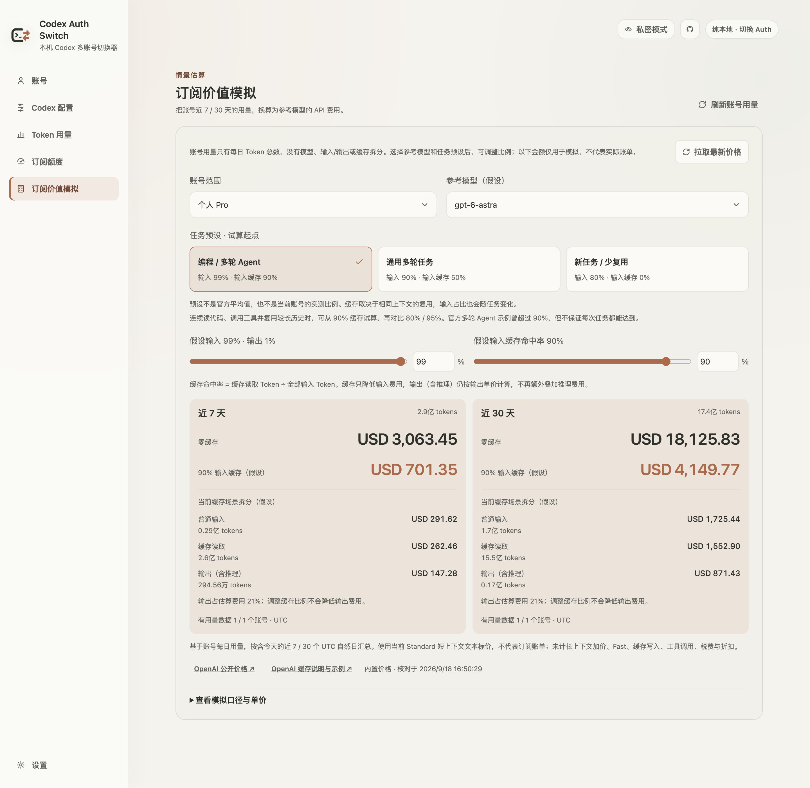
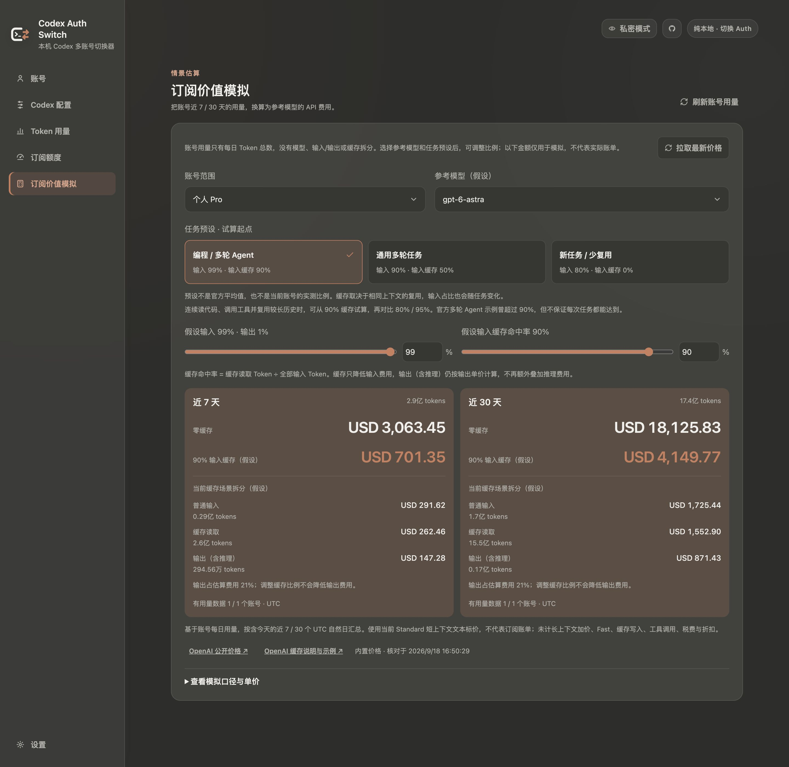
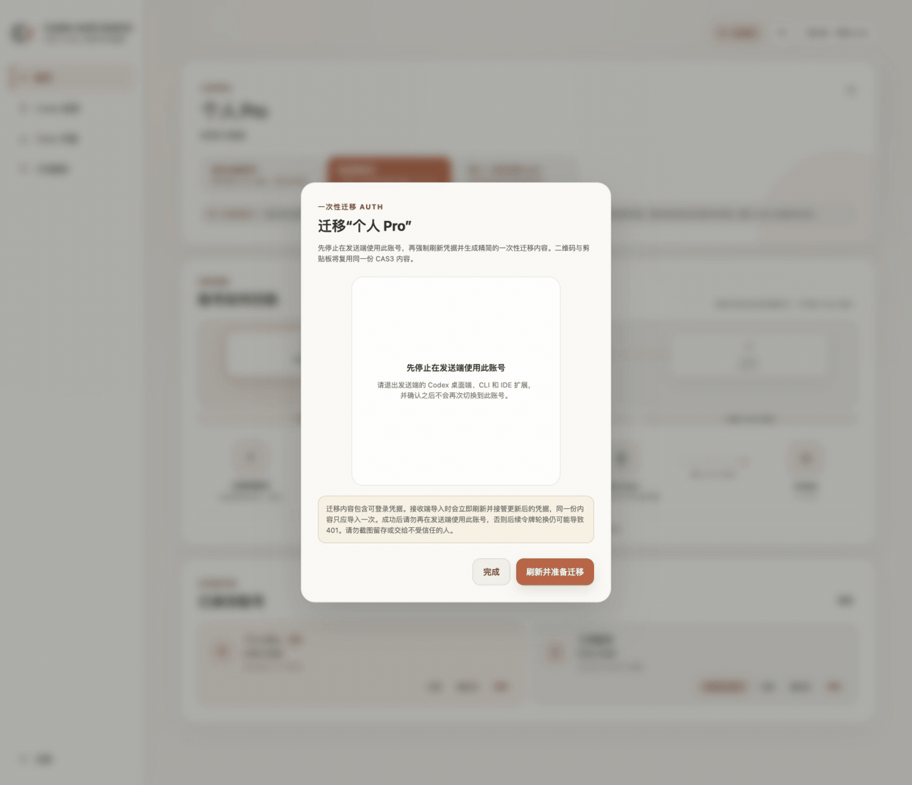

<div align="center">

<picture>
  <source media="(prefers-color-scheme: dark)" srcset="./docs/images/app-icon-dark.svg">
  
</picture>

</div>

<h1 align="center">Codex Auth Switch</h1>

<p align="center"><a href="./README.md">简体中文</a> · <strong>English</strong></p>
<p align="center">A local-only account switcher for Codex ChatGPT</p>

<p align="center">
  <a href="https://github.com/Mintimate/codex-auth-switch/releases/latest">Download</a> ·
  <a href="#quick-start">Quick start</a> ·
  <a href="#codex-configuration">Codex configuration</a> ·
  <a href="#subscription-value-simulator">Value simulator</a> ·
  <a href="#security-boundaries">Security</a> ·
  <a href="#development">Development</a> ·
  <a href="https://github.com/Mintimate/codex-auth-switch/issues">Report an issue</a>
</p>

<a href="./docs/images/dashboard-light.jpg">
  <picture>
    <source media="(prefers-color-scheme: dark)" srcset="./docs/images/dashboard-dark.jpg">
    
  </picture>
</a>

> Both READMEs use Chinese UI screenshots from the app's built-in demo data. They contain no real accounts, tokens, or authentication data.
> Static screenshots are rendered at 2× resolution, with originals 2880 pixels wide; the GIF retains its original dimensions. Click an image to view the original.

Codex Auth Switch saves and switches multiple Codex ChatGPT logins on one device. It also provides Codex configuration editing, local Token usage, subscription quotas, subscription value simulation, and environment diagnostics. It does not proxy Codex requests, collect telemetry, or manage API keys, subscription billing, or workspace seats.

> [!IMPORTANT]
> This project is not affiliated with, sponsored by, or endorsed by OpenAI. Codex, ChatGPT, and OpenAI are trademarks of their respective owners.

## Highlights

The sidebar organizes actions and data into six pages:

| Page                         | Purpose                                                                                                                  |
| ---------------------------- | ------------------------------------------------------------------------------------------------------------------------ |
| Accounts                     | Save, rename, and switch local accounts; sign in through local Codex or Device Code; transfer Auth once with a QR code or clipboard     |
| Codex config                 | Edit credential storage, context window, reasoning, response verbosity, and web search settings                          |
| Token usage                  | View local session totals, daily trends, and attribution by account and model provider                                   |
| Subscription quotas          | Search, filter, and compare account quotas, recovery times, reset credits, and daily activity                            |
| Subscription value simulator | Independently estimate the API value of 7 / 30 days of account usage with adjustable models, shares, and cost breakdowns |
| Settings                     | Choose language, theme, privacy, and startup page; manage automatic refresh, diagnostics, and signed updates             |

Consistent text sizes and responsive layouts keep controls, cards, and scrollable tables readable in narrower windows. The value simulator opens with its controls visible, can be the default startup page, and provides separate account-usage and price refresh actions.

## Interface Preview

**Subscription value simulator: task presets, input and cache shares, and cost breakdown**

[](docs/images/value-light.jpg)

<details>
<summary>View the value simulator in dark mode</summary>

[](docs/images/value-dark.jpg)

</details>

| Codex configuration                                                                                                         | Token usage                                                                                                               |
| --------------------------------------------------------------------------------------------------------------------------- | ------------------------------------------------------------------------------------------------------------------------- |
| [](docs/images/config-light.jpg) | [](docs/images/usage-light.jpg) |

| Subscription quotas                                                                                                                    | Settings                                                                                                                              |
| -------------------------------------------------------------------------------------------------------------------------------------- | ------------------------------------------------------------------------------------------------------------------------------------- |
| [](docs/images/quota-light.jpg) | [](docs/images/settings-light.jpg) |

| Diagnostics                                                                                                                    | One-time Auth transfer                                                                                                                  |
| ------------------------------------------------------------------------------------------------------------------------------ | --------------------------------------------------------------------------------------------------------------------------------------- |
| [](docs/images/diagnostics-light.jpg) | [](docs/images/auth-share-dialog.gif) |

The Auth transfer animation uses a built-in demo pattern with no usable credentials.

## Download and Install

Download the installer for your system from [Releases](https://github.com/Mintimate/codex-auth-switch/releases/latest).

| System  | Architecture          | Format                        |
| ------- | --------------------- | ----------------------------- |
| macOS   | Apple Silicon / Intel | `.dmg`                        |
| Windows | x64                   | `.exe` / `.msi`               |
| Linux   | x64                   | `.AppImage` / `.deb` / `.rpm` |

The macOS package uses an ad hoc signature, so first launch may require approval in System Settings → Privacy & Security. Download only from this project's Releases page.

## Quick Start

### 1. Enable file-based credential storage

Open **Codex config** in the sidebar and select **File** under **Credential storage**, or use **Enable file-based login management** when prompted on the account page. This sets the following in `CODEX_HOME/config.toml` (default: `~/.codex/config.toml`):

```toml
cli_auth_credentials_store = "file"
```

The app does not change an existing storage mode automatically. Saving the current account, switching, and quota queries require file storage. Local Codex sign-in can still save a new account under `auto` or `keyring`; file storage is enabled explicitly when switching, and API Key authentication is never saved as a subscription account.

### 2. Save or add an account

Save the current Codex ChatGPT login, or select **Add account**, choose a local name and a sign-in method:

- **Local Codex sign-in (experimental)** is off by default. Enable it in **Labs**, then select it in **Add account**. It uses an installed Codex CLI or bundled desktop runtime for browser authorization. It saves the account to the local vault; switch afterward or from the account list. Signing in to an existing account updates its record and marks the new login as ready to switch.
- **OAuth sign-in (device code)** retains the existing Device OAuth flow. Enter the pairing code and authorize to save and switch automatically, then restart Codex.

Local Codex sign-in uses a separate temporary directory and preserves current authentication and storage settings. Open the authorization link on this computer so its local callback can complete. If the runtime is unavailable, unsupported, or the callback port is occupied, end the sign-in and use a device code. Cancellation, timeout, and normal app exit stop the sign-in process and remove its temporary directory; startup removes leftover session directories older than a day.

### 3. Switch accounts

Select **Switch** beside the two-arrow icon, then choose **Switch only** or **Switch and restart**. You can remember the choice and change it under **Settings → Saved account switching**. The default is to ask every time, with automatic restart off.

Restarting validates the target and desktop app, requests a normal quit, waits for the app to exit, saves the previous account's latest credentials, atomically replaces `auth.json`, and reopens the same app. Finish running tasks first. A quit timeout leaves authentication unchanged and never force-kills processes. A launch failure is reported separately after a successful account switch. An app that is already closed is not launched.

The local restart compatibility layer supports macOS (`com.openai.codex`) and identifiable OpenAI Codex desktop executables on Windows. It does not terminate standalone CLI or IDE sessions. Use **Switch only** and restart manually on Linux, with a custom `CODEX_HOME`, multiple desktop instances, or an unidentified client. This preference does not affect Device Code sign-in or Auth imports; switching after local Codex sign-in uses this preference. This is a local compatibility implementation, not an officially guaranteed account-switching API.

After switching a saved account, the Accounts page shows the operation outcome, credential-file match and desktop process state. **Check again** reads local state without signing in or restarting. Verify the identity inside Codex; a running or restarted process does not confirm its account. The report lasts for the current app session.

### 4. Transfer to another device (optional)

One-time Auth transfer supports QR codes and the clipboard. Stop Codex sessions on the sending device first; the receiver immediately refreshes and validates the account during import, then restart Codex after the credentials are written for the switch to take effect. For ongoing access on both devices, start a new OAuth authorization on the receiving device instead.

## Labs

Labs groups experimental features in the sidebar. Local Codex sign-in is off by default, and its toggle is saved only on this device. Enable it to choose local Codex or OAuth in the sign-in dialog. Turning it off restores OAuth as the available method and keeps saved accounts.

## Codex Configuration

The configuration page edits the local `config.toml`. Each selection updates only the corresponding supported fields, preserves other settings and comments, and displays the resulting values inline.

| Setting            | Options                                                               |
| ------------------ | --------------------------------------------------------------------- |
| Credential storage | Default, file, auto, or keyring; account switching requires file mode |
| Context window     | Codex defaults, or 1M context with a 900K auto-compaction threshold   |
| Reasoning effort   | Default, minimal, low, medium, high, or extra high                    |
| Reasoning summary  | Default, auto, concise, detailed, or off                              |
| Response verbosity | Default, low, medium, or high                                         |
| Web search         | Default, disabled, cached, indexed, or live                           |

Selecting **Default** removes the corresponding fields so Codex can use its defaults. Existing values outside the presets appear as **Custom** and remain unchanged until you select a preset. Settings such as 1M are local configuration presets; support depends on the Codex version, model, and service in use.

## Usage and Quotas

| Page                         | Data source                                                | Meaning                                                                            |
| ---------------------------- | ---------------------------------------------------------- | ---------------------------------------------------------------------------------- |
| Token usage                  | Local Codex session metadata                               | This device's usage for today, 7 days, and 30 days; not account-wide totals        |
| Subscription quotas          | Online account limits and daily Token totals               | Available quota, recovery times, and account usage; some fields may be unavailable |
| Subscription value simulator | The same account daily totals, plus reference model prices | An API cost simulation based on assumptions, not a subscription or API bill        |

All three pages can refresh on demand; opening Accounts does not query quotas. Disable **Refresh when opened** under **Settings → Usage and quotas** to load data manually. The value simulator can refresh account usage directly, without opening the quota page first.

Refresh all accounts or one account at a time. Different accounts share two concurrent query slots; requests for the same account are serialized. Failures retain previous results and their timestamps; an initial failure offers a retry, and missing data stays unknown. Not every account returns every quota field. Wait before retrying a rate-limited request.

### Quota history

Open the history icon in **Subscription quotas**, or **Account details → Quota history**, to review observations over 24 hours, 7 days or 30 days. Successful manual and page-triggered queries record returned window percentages, timestamps, source and plan metadata. Viewing history itself does not send an online query, reconstruct past data or record failures as zero.

Percentage-point changes are calculated only for the same account, bucket, window, source, plan, duration and known reset timestamp. Period boundaries, source changes or missing metadata break the trend line. A rise in remaining quota does not confirm a reset or identify which device or task caused a change.

The separate local `quota-history.v1.json` retains up to 30 days, 12,000 window observations overall and 2,000 per account, with an 8 MiB file limit. Access and writes prune expired and oldest entries, so storage cannot grow indefinitely. Each window counts separately; more frequent queries or additional windows retain fewer days once the record cap is reached. A history-write failure is reported separately and preserves successful quota results and refreshed credentials. Confirm **Clear all local quota history** to start over without deleting accounts or credentials. Removing an account also attempts to remove its history. Cleanup failures produce a separate notice and never block account removal or alter other credentials. Corrupt history is preserved until explicitly cleared.

<details>
<summary>Local usage cache and cleanup</summary>

Local usage supports `file`, `auto`, and `keyring` credential modes. The rebuildable `usage-cache.v2.json.gz` reuses unchanged file statistics, reads new complete lines incrementally, and rescans truncated or replaced files. It stores file validation metadata, provider identifiers, timestamps, and Token counts, without session bodies or authentication data. Account attribution depends on locally recorded switching history.

The compressed cache is capped at 8 MiB and retains 35 days of statistics. Older entries can be evicted without affecting current complete totals. Startup and cache access remove caches not updated for 7 days, along with the legacy cache. View or clear it under **Settings → Usage and quotas**. Clearing preserves accounts, credentials, and session files; the next refresh rebuilds it as needed.

</details>

## Subscription Value Simulator

Select all accounts or one account to aggregate daily Token totals for 7 / 30 UTC calendar days including today. Duplicate local profiles of the same subscription are counted once. This feature does not read local sessions, and account totals do not reveal the actual model, input/output, or cache breakdown.

| Simulation preset           | Input share | Cached-input share |
| --------------------------- | ----------- | ------------------ |
| Multi-turn coding (default) | 99%         | 90%                |
| General multi-turn tasks    | 90%         | 50%                |
| New tasks / little reuse    | 80%         | 0%                 |

Presets are starting assumptions, **not averages, measured account usage, or actual bills**. Adjust both shares with sliders or numeric inputs in 0.1% increments. The cache share applies to input tokens; output receives no cache discount. The page compares against no cache and separates regular-input, cached-input, and output costs. A missing cached rate affects a scenario only when its assumed cached-input count is greater than zero.

Reusing context can improve cache hits, while compaction, model changes, or longer gaps can reduce reuse. The [official multi-turn agent caching example](https://developers.openai.com/api/docs/guides/prompt-caching#multi-turn-agent) reports above 90% for a particular deployment, not an average across tasks.

Prices come from [OpenAI public pricing](https://developers.openai.com/api/docs/pricing). Bundled or locally cached prices load by default; **Fetch latest prices** downloads only the public document, without credentials or usage. Failures retain previous prices and their date. Simulations use Standard short-context text rates and exclude long-context premiums, Fast, cache writes, tools, taxes, and discounts. Pricing parsing is isolated from authentication and quota compatibility layers and does not guess prices when the document changes.

## Security Boundaries

```text
CODEX_HOME/auth.json
        ↕ local read / atomic replacement
Codex Auth Switch (Tauri + Rust)
        ↕ local account vault
accounts.v1.json
```

- Account snapshots, Token aggregation, and diagnostics stay on the device; there is no project-operated backend, telemetry, or analytics
- Rust handles authentication reads, validation, transfer, and writes; raw tokens never enter the frontend or logs
- On macOS/Linux, the app-data directory uses `0700`, while the vault and temporary credential files use `0600`
- API Key authentication remains separate from ChatGPT subscription authentication
- Usage scans read only `token_count` and `session_meta.model_provider`; prompts and responses are not retained
- Subscription data prefers the local Codex App Server; direct HTTP fallback is an isolated compatibility implementation, not a guaranteed stable public API

> [!WARNING]
> OAuth pairing codes and one-time Auth transfers can grant account access. Share them only with the intended account owner, and stop using the account on the sending device after a successful transfer.

## Current Limitations

- Saving the current account, switching accounts, querying subscription quotas, and loading account usage for the value simulator require `cli_auth_credentials_store = "file"`; local Token usage does not
- Local Codex sign-in requires App Server support for `account/login/start`; capabilities depend on the installed version. Initialization was checked on macOS; real authorization and Windows/Linux still need manual smoke testing.
- Device Code login is still beta and may need to be enabled by the user or workspace administrator
- The official App Server does not provide subscription expiry, and local Token totals are not the official subscription quota
- Historical sessions lack reliable account IDs, so attribution begins after the app starts recording the switch timeline

## Development

Requires Node.js 20+, Rust stable, npm, and the platform dependencies for Tauri 2.

```bash
npm install
npm run dev
```

For a browser UI preview, run `npm run dev:web` and open the address printed in the terminal. Browser development mode uses built-in demo data for pages and themes; validate real account operations in the Tauri app. Follow the [typography guide](docs/typography.md) when changing the UI, and check both languages, themes, and narrow-window layouts.

Checks before committing:

```bash
npm run format
npm run typecheck
npm run build:web

cd src-tauri
cargo fmt --all
cargo test
```

Use `npm run release <version>` to synchronize versions, create the release commit, and tag it. Pushing a `v*` tag lets CI build, sign, and publish installers for every platform.

## License

[MIT](LICENSE)
