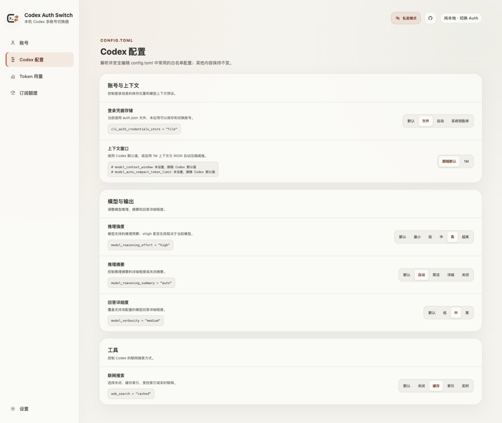
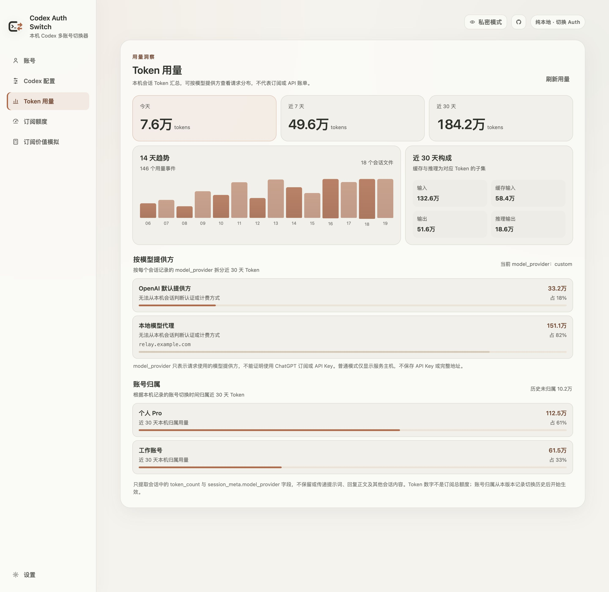
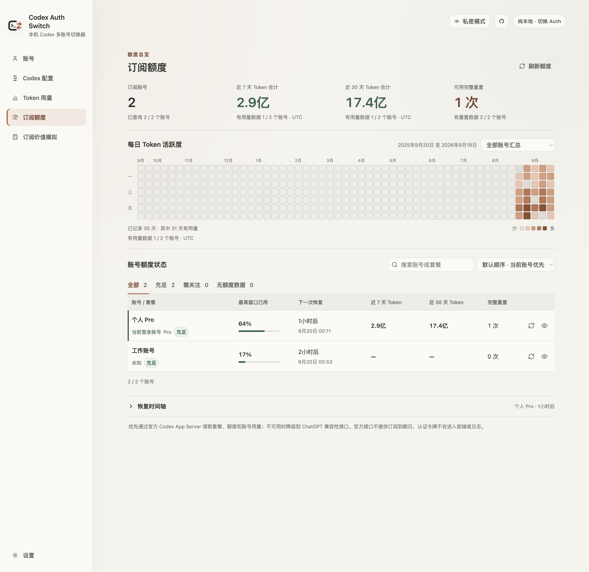
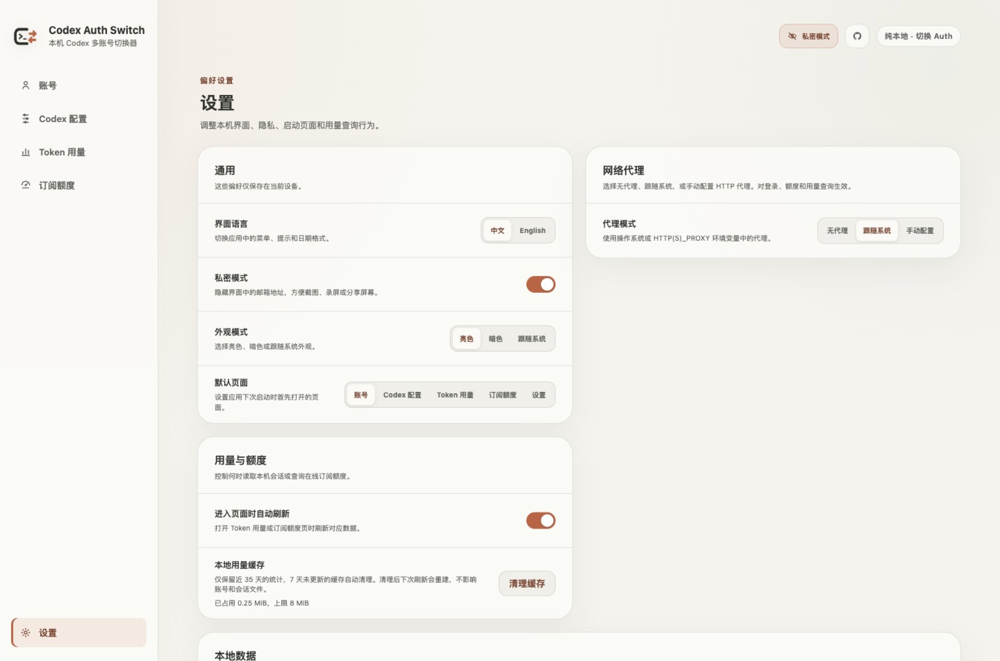
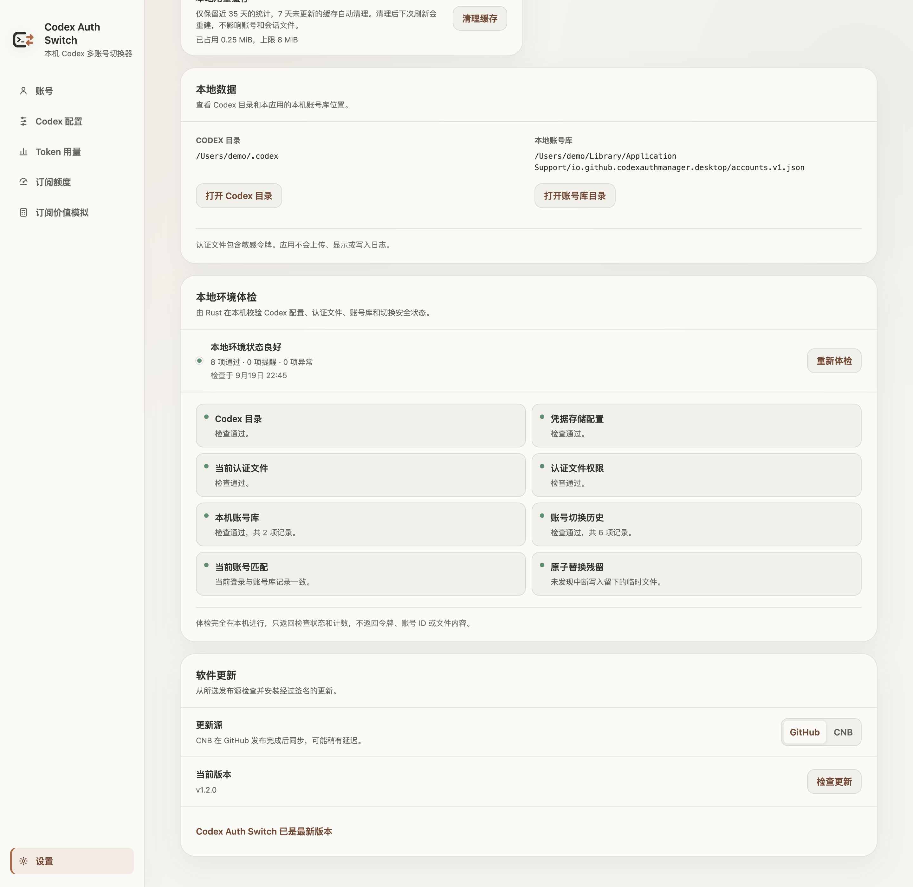

<div align="center">

<picture>
  <source media="(prefers-color-scheme: dark)" srcset="./docs/images/app-icon-dark.svg">
  
</picture>

</div>

<h1 align="center">Codex Auth Switch</h1>

<p align="center"><a href="./README.md">简体中文</a> · <strong>English</strong></p>
<p align="center">A local-only account switcher for Codex ChatGPT</p>

<p align="center">
  <a href="https://github.com/Mintimate/codex-auth-switch/releases/latest">Download</a> ·
  <a href="#quick-start">Quick start</a> ·
  <a href="#codex-configuration">Codex configuration</a> ·
  <a href="#security-boundaries">Security</a> ·
  <a href="#development">Development</a> ·
  <a href="https://github.com/Mintimate/codex-auth-switch/issues">Report an issue</a>
</p>

<picture>
  <source media="(prefers-color-scheme: dark)" srcset="./docs/images/dashboard-dark.jpg">
  
</picture>

> Screenshots show the Chinese interface with built-in preview data from 1.1.1. They contain no real accounts, tokens, or authentication data.

Codex Auth Switch saves and switches multiple Codex ChatGPT logins on one device. It also provides Codex configuration editing, local Token usage, subscription quotas, and environment diagnostics. It does not proxy Codex requests, collect telemetry, or manage API keys, subscription billing, or workspace seats.

> [!IMPORTANT]
> This project is not affiliated with, sponsored by, or endorsed by OpenAI. Codex, ChatGPT, and OpenAI are trademarks of their respective owners.

## Highlights

- Save, rename, and switch local accounts while preserving rotated tokens before each switch
- Add an account through browser-based Device Code authorization without entering a password in the app
- Configure credential storage, the 1M context preset, reasoning effort and summaries, response verbosity, and web search
- Summarize local session Tokens for today, 7 days, and 30 days, split by account and model provider
- Show quota windows, recovery timelines, 7-day Tokens, and a one-year activity heatmap
- Refresh usage and quotas independently when opening their pages, with an option to load data manually
- Transfer Auth once through a QR code or clipboard, with legacy CAS2 import compatibility
- Run read-only diagnostics, hide emails with privacy mode, and use light/dark themes, Chinese/English UI, and signed updates from GitHub or CNB

## Interface Preview

| Codex configuration                                                                                                | Token usage                                                                                                      |
| ------------------------------------------------------------------------------------------------------------------ | ---------------------------------------------------------------------------------------------------------------- |
|  |  |

| Subscription quotas                                                                                          | App settings                                                                                     |
| ------------------------------------------------------------------------------------------------------------ | ------------------------------------------------------------------------------------------------ |
|  |  |

<details>
<summary>Diagnostics and one-time Auth transfer</summary>

| Diagnostics                                                                 | One-time Auth transfer                                                                                                  |
| --------------------------------------------------------------------------- | ----------------------------------------------------------------------------------------------------------------------- |
|  |  |

</details>

## Download and Install

Download the installer for your system from [Releases](https://github.com/Mintimate/codex-auth-switch/releases/latest).

| System  | Architecture          | Format                        |
| ------- | --------------------- | ----------------------------- |
| macOS   | Apple Silicon / Intel | `.dmg`                        |
| Windows | x64                   | `.exe` / `.msi`               |
| Linux   | x64                   | `.AppImage` / `.deb` / `.rpm` |

The macOS package uses an ad hoc signature, so first launch may require approval in System Settings → Privacy & Security. Download only from this project's Releases page.

## Quick Start

### 1. Enable file-based credential storage

Open **Codex config** in the sidebar and select **File** under **Credential storage**, or use **Enable file-based login management** when prompted on the account page. This sets the following in `CODEX_HOME/config.toml` (default: `~/.codex/config.toml`):

```toml
cli_auth_credentials_store = "file"
```

The app does not change an existing storage mode automatically. Account management is unavailable when `auto` or `keyring` is selected, and API Key authentication is never saved as a subscription account.

### 2. Save or add an account

Open the app to save the current Codex ChatGPT login, or select **Add account**, choose a local name, and complete Device Code authorization in a browser. Successful authorization automatically saves and switches to the new account.

### 3. Switch accounts

Select **Switch to this account** in the local vault. The app validates the target and atomically replaces the `auth.json` used by Codex.

### 4. Transfer to another device (optional)

One-time Auth transfer supports QR codes and the clipboard. Stop Codex sessions on the sending device first; the receiver immediately refreshes and validates the account during import. For ongoing access on both devices, start a new OAuth authorization on the receiving device instead.

## Codex Configuration

The configuration page edits the local `config.toml`. Each selection updates only the corresponding supported fields, preserves other settings and comments, and displays the resulting values inline.

| Setting            | Options                                                               |
| ------------------ | --------------------------------------------------------------------- |
| Credential storage | Default, file, auto, or keyring; account switching requires file mode |
| Context window     | Codex defaults, or 1M context with a 900K auto-compaction threshold   |
| Reasoning effort   | Default, minimal, low, medium, high, or extra high                    |
| Reasoning summary  | Default, auto, concise, detailed, or off                              |
| Response verbosity | Default, low, medium, or high                                         |
| Web search         | Default, disabled, cached, indexed, or live                           |

Selecting **Default** removes the corresponding fields so Codex can use its defaults. Existing values outside the presets appear as **Custom** and remain unchanged until you select a preset. Settings such as 1M are local configuration presets; support depends on the Codex version, model, and service in use.

## Usage and Quotas

**Token usage** aggregates local session metadata; **Subscription quotas** queries online account limits. The pages load independently, and opening the account page does not query subscription quotas. Disable **Refresh when opened** under **Settings → Usage and quotas** to load data manually with each page's button.

When available, the quota page shows the plan, multiple quota windows, full-reset credits and expiry dates, account usage, and an activity heatmap. Not every account or data source returns all of these fields. Network errors can be retried manually; wait before retrying a rate-limited request.

Refresh all accounts or refresh one account from its card. Different accounts share two concurrent query slots; queries for the same account are serialized. Batch results appear as each account finishes. Failed refreshes retain the last successful result and show the error alongside the original query time.

Local usage works with `file`, `auto`, and `keyring` credential modes without migrating credentials. A rebuildable `usage-cache.v2.json.gz` in the app data directory reuses unchanged files, parses only new complete lines in appended files, and rescans truncated or replaced files. It stores file validation metadata, provider identifiers, event timestamps, and Token counts, without session bodies or authentication data. Account attribution still depends on locally recorded switching history. The compressed cache is capped at 8 MiB and retains 35 days of statistics. Older file entries are evicted when needed without changing the current complete totals. Startup and cache access remove caches not updated for 7 days, along with the legacy cache. View the size or clear it under **Settings → Usage and quotas**. Clearing preserves accounts, credentials, and Codex session files; the next refresh rebuilds the cache as needed.

## Security Boundaries

```text
CODEX_HOME/auth.json
        ↕ local read / atomic replacement
Codex Auth Switch (Tauri + Rust)
        ↕ local account vault
accounts.v1.json
```

- Account snapshots, Token aggregation, and diagnostics stay on the device; there is no project-operated backend, telemetry, or analytics
- Rust handles authentication reads, validation, transfer, and writes; raw tokens never enter the frontend or logs
- On macOS/Linux, the app-data directory uses `0700`, while the vault and temporary credential files use `0600`
- API Key authentication remains separate from ChatGPT subscription authentication
- Usage scans read only `token_count` and `session_meta.model_provider`; prompts and responses are not retained
- Subscription data prefers the local Codex App Server; direct HTTP fallback is an isolated compatibility implementation, not a guaranteed stable public API

> [!WARNING]
> OAuth pairing codes and one-time Auth transfers can grant account access. Share them only with the intended account owner, and stop using the account on the sending device after a successful transfer.

## Current Limitations

- Saving and switching accounts and querying subscription quotas require `cli_auth_credentials_store = "file"`; local Token usage does not
- Device Code login is still beta and may need to be enabled by the user or workspace administrator
- The official App Server does not provide subscription expiry, and local Token totals are not the official subscription quota
- Historical sessions lack reliable account IDs, so attribution begins after the app starts recording the switch timeline

## Development

Requires Node.js 20+, Rust stable, npm, and the platform dependencies for Tauri 2.

```bash
npm install
npm run dev
```

Checks before committing:

```bash
npm run format
npm run typecheck
npm run build:web

cd src-tauri
cargo fmt --all
cargo test
```

Use `npm run release <version>` to synchronize versions, create the release commit, and tag it. Pushing a `v*` tag lets CI build, sign, and publish installers for every platform.

## License

[MIT](LICENSE)
