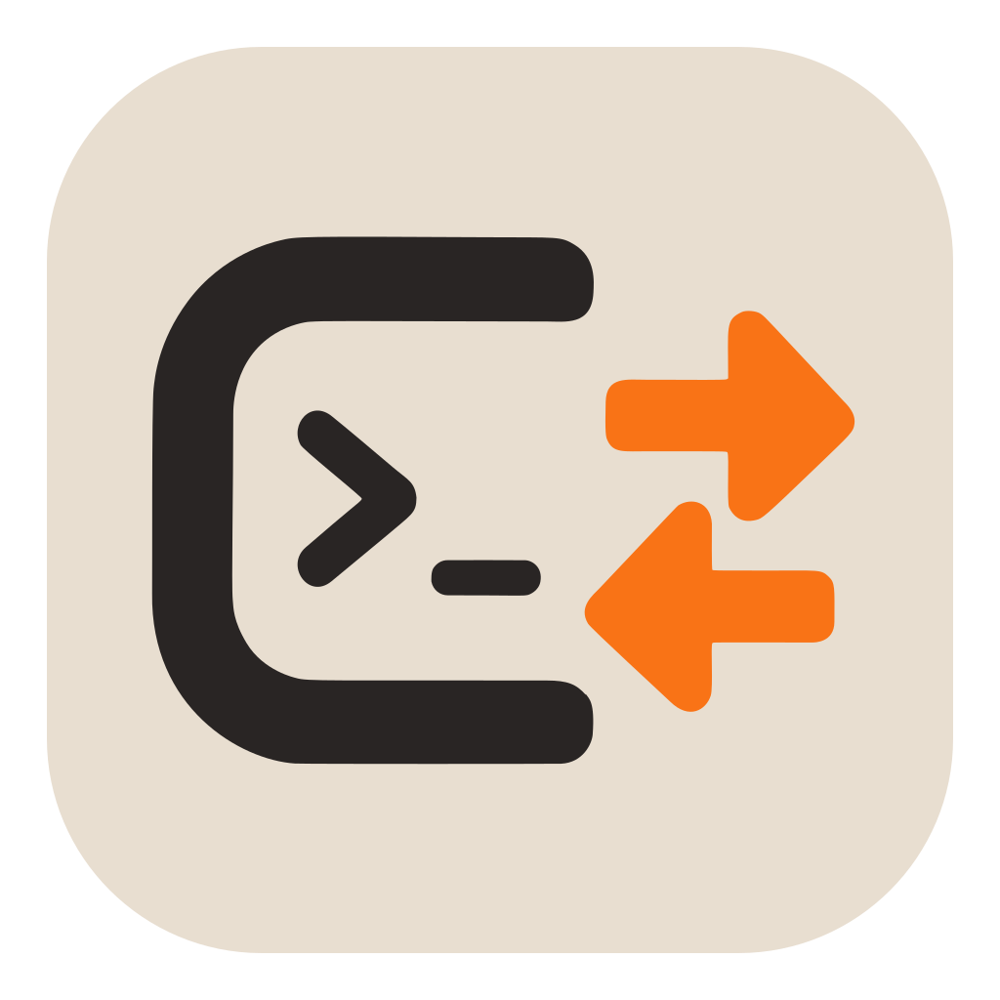
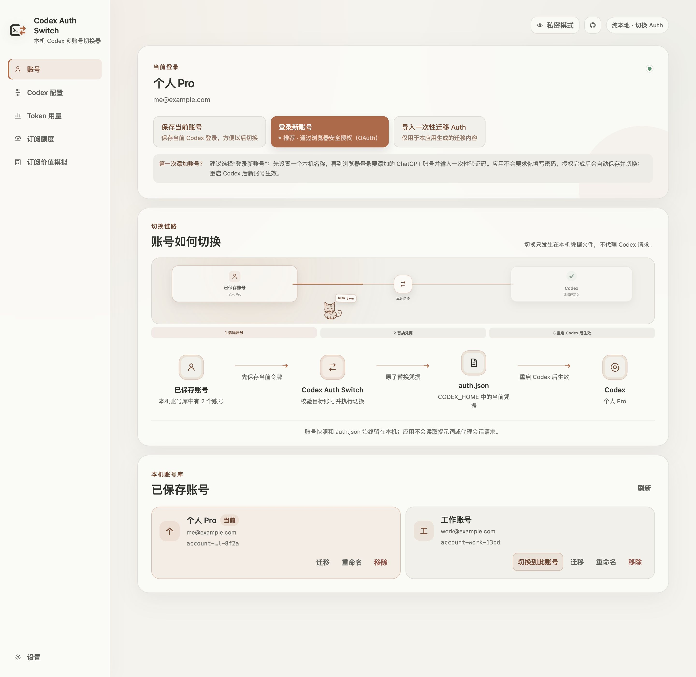
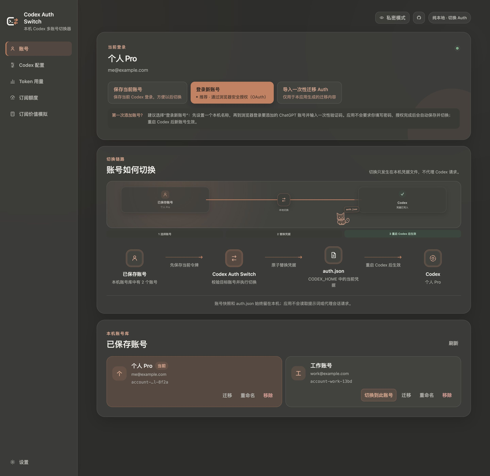
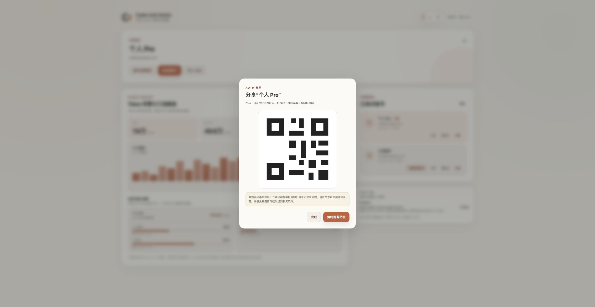

<div align="center">

<picture>
  <source media="(prefers-color-scheme: dark)" srcset="./docs/images/app-icon-dark.svg">
  
</picture>

</div>

<h1 align="center">Codex Auth Switch</h1>

<p align="center"><a href="./README.md">简体中文</a> | <strong>English</strong></p>

<p align="center">Local only · Switch Auth</p>

<p align="center">
  <a href="https://github.com/Mintimate/codex-auth-switch/releases/latest">Download the latest release</a> |
  <a href="#quick-start">Quick start</a> |
  <a href="#features">Features</a> |
  <a href="#security-model">Data security</a> |
  <a href="https://github.com/Mintimate/codex-auth-switch/releases">Release history</a> |
  <a href="#development">Development</a> |
  <a href="https://github.com/Mintimate/codex-auth-switch/issues">Report an issue</a>
</p>



> The screenshots use built-in preview data and contain no real account or authentication information.

Codex Auth Switch is built for switching between multiple Codex ChatGPT logins on one computer. It does not manage OpenAI subscriptions, billing, or API keys. It does not proxy Codex requests, collect telemetry, or send authentication data to a project-operated service.

> [!IMPORTANT]
> This project is not affiliated with, sponsored by, or endorsed by OpenAI. Codex, ChatGPT, and OpenAI are trademarks of their respective owners.

## Interface Preview

| Dark theme                                                       | Auth sharing dialog                                                       |
| ---------------------------------------------------------------- | ------------------------------------------------------------------------- |
|  |  |

## Download and Install

Download the installer for your system from [Releases](https://github.com/Mintimate/codex-auth-switch/releases/latest).

| System  | Architecture          | Format                        |
| ------- | --------------------- | ----------------------------- |
| macOS   | Apple Silicon / Intel | `.dmg`                        |
| Windows | x64                   | `.exe` / `.msi`               |
| Linux   | x64                   | `.AppImage` / `.deb` / `.rpm` |

The macOS package uses an ad hoc signature. On first launch, you may need to approve it in System Settings → Privacy & Security. Some systems may also warn about open-source installers that are not signed with a commercial certificate. Make sure your download came from this project's GitHub Releases page.

## Quick Start

### 1. Enable file-based credential storage

The current release manages only file-based Codex credentials. Add the following setting to `CODEX_HOME/config.toml` (the default is `~/.codex/config.toml`):

```toml
cli_auth_credentials_store = "file"
```

The app does not modify `keyring` or `auto` configurations and displays a clear warning when either mode is active. API Key authentication remains separate from ChatGPT subscription authentication and is never treated as a switchable subscription account.

### 2. Save the current login

Open the app, give the current Codex ChatGPT login a local name, and select **Save current login**.

### 3. Add or import an account

- **Log in to another account**: complete Device Code authorization in your browser. The app saves and switches to the account after authorization succeeds.
- **Import Auth**: read sharing text or a QR code generated by this app.

### 4. Switch with one click

Select **Switch to this account** under **Saved accounts**. Before switching, the app saves any rotated tokens for the current account, then atomically replaces the authentication file used by Codex.

## Features

### Account Management

- Detect the current Codex ChatGPT login
- Save, rename, and switch local accounts
- Add accounts through browser-based Device Code authorization
- Remove the locally saved copy of any account; removing the current account does not sign out or interrupt the active Codex login
- Capture potentially rotated tokens for the current account before switching

### Usage Insights

- Summarize local token usage for today, the last 7 days, and the last 30 days
- Show a 14-day trend, input/output token composition, and account attribution
- Display subscription usage windows per account, with isolated fallback when one account query fails
- Read only `token_count` metadata from sessions without parsing prompts or response text

### Auth Sharing

- Move Auth between trusted devices through the system clipboard or a QR code
- Perform payload encoding, decoding, clipboard access, and QR processing entirely in the Rust backend
- Keep raw, copyable token text out of the frontend

### Desktop Experience

- Chinese and English interface with a persistent language switcher
- Separate tabs for accounts, Token usage, and settings, with a configurable startup page
- Optional automatic refresh when opening the Token usage tab
- Light, dark, and system appearance modes
- Desktop installers for macOS, Windows, and Linux
- Visible local account vault path with direct access from the file manager
- Signed update checks and installation from either GitHub or CNB Releases in Settings

## Data Boundaries

```text
CODEX_HOME/auth.json
        ↕ local read / atomic replacement
Codex Auth Switch (Tauri + Rust)
        ↕ local account vault
accounts.v1.json
```

- The app does not proxy Codex session requests and has no project-operated backend, telemetry, or analytics service.
- During Device Code login, it communicates directly with OpenAI authentication services and requests only the authentication data needed for the local Codex cache.
- Subscription usage queries access a ChatGPT compatibility endpoint directly. OpenAI does not guarantee this endpoint or its fields as a stable public API. Changes may affect quota display but not account switching or local token statistics.
- Token counts on the usage page summarize local session metadata; they are not the official total ChatGPT subscription quota.
- Historical Codex sessions do not contain a reliable account ID. Account attribution begins after the app starts recording the switching timeline; older data appears as **Unassigned history**.

## Security Model

In file credential mode, Codex stores the login cache in `CODEX_HOME/auth.json`, which defaults to `~/.codex/auth.json`. This file contains access tokens and should be protected like a password.

Codex Auth Switch stores account snapshots in its own application data directory:

- The application data directory uses `0700` permissions on macOS and Linux
- The account vault and temporary authentication files use `0600` permissions
- Routine status commands return only redacted account summaries to the frontend
- Local token parsing happens entirely in the Rust backend; the frontend receives aggregate numbers only
- Logs and error messages never contain tokens
- Credential switching uses same-directory atomic replacement on macOS and Linux

Local file permissions cannot provide additional protection if another privileged user already controls the device. System keychain storage is not currently supported.

> [!WARNING]
> Auth sharing payloads contain login credentials and are not encrypted backups. Use them only between devices you control or explicitly trust. Clear the system clipboard after pasting, and do not send QR code screenshots through messaging apps or upload them to cloud storage.

## Current Limitations

- Only `cli_auth_credentials_store = "file"` is supported
- Device Code login is still in beta and may need to be enabled by an individual user or workspace administrator
- Subscription usage windows come from a compatibility implementation, not a guaranteed stable public API
- Local token data depends on available `token_count` metadata in Codex session files
- The project does not manage OpenAI API keys, subscription billing, or workspace seats

## Development

Requirements:

- Node.js 20+
- Rust stable
- npm
- Platform build dependencies for Tauri 2

```bash
npm install
npm run dev
```

Frontend checks:

```bash
npm run format
npm run typecheck
npm run build:web
```

Rust checks:

```bash
cd src-tauri
cargo fmt --all
cargo test
```

The release workflow requires the GitHub Actions secret `TAURI_SIGNING_PRIVATE_KEY`. If the private key has a password, also configure `TAURI_SIGNING_PRIVATE_KEY_PASSWORD`. The matching public key is pinned in `src-tauri/tauri.conf.json`; keep the private key for all future releases so installed versions can verify updates.

## Releasing a New Version

The version number lives in three places — `package.json`, `src-tauri/Cargo.toml`, and `src-tauri/tauri.conf.json` — and they must match exactly. Use the script instead of editing each file by hand:

```bash
npm run bump 0.7.3      # update version files only
npm run release 0.7.3   # update versions, then create the commit and tag
```

The script updates `package.json`, `package-lock.json`, `src-tauri/Cargo.toml`, `src-tauri/Cargo.lock`, and `src-tauri/tauri.conf.json`, then reads the files back to verify all three versions agree. `Cargo.lock` may contain third-party crates that share this project's version number, so the script only edits the `codex-auth-switch` package block.

Once the changes look right, push the tag to start the release:

```bash
git push origin main --follow-tags
```

The workflow reads the version from `src-tauri/tauri.conf.json` and fails if the Git tag does not match. After the tag is pushed, building all four platform installers, generating release notes, verifying the updater manifest and signatures, promoting the draft to a published release, and mirroring to CNB all happen automatically.

To write release notes by hand, add `docs/release-notes/vX.Y.Z.md` before tagging. Otherwise notes are generated from Conventional Commits.

## Project Structure

```text
src/                        React desktop interface
src-tauri/src/manager.rs    Account vault, authentication validation, and switching
src-tauri/src/usage.rs      Local session token aggregation
src-tauri/src/auth_share.rs Auth sharing encoding and QR code processing
src-tauri/src/lib.rs        Tauri command boundary
src-tauri/icons/            App icons; CI compiles Assets.xcassets into macOS light and dark icons
scripts/bump-version.mjs    Version synchronization script
docs/images/                README preview screenshots and app icons
docs/release-notes/         Hand-written release notes (optional)
```

## Official References

- [OpenAI authentication documentation](https://learn.chatgpt.com/docs/auth)
- [OpenAI Codex plans and usage](https://learn.chatgpt.com/docs/pricing)

OpenAI's documentation marks Device Code login as beta and notes that users or workspace administrators may need to enable it in ChatGPT security settings. The official usage guide also explains that usage depends on the model, context, and task complexity, and that local and cloud tasks share the applicable usage windows. This README confirms those product capabilities. The specific HTTP endpoints and fields used by the app are compatibility details and should not be interpreted as an OpenAI commitment to public API stability.

## License

[MIT](LICENSE)
